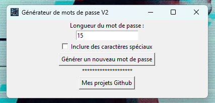
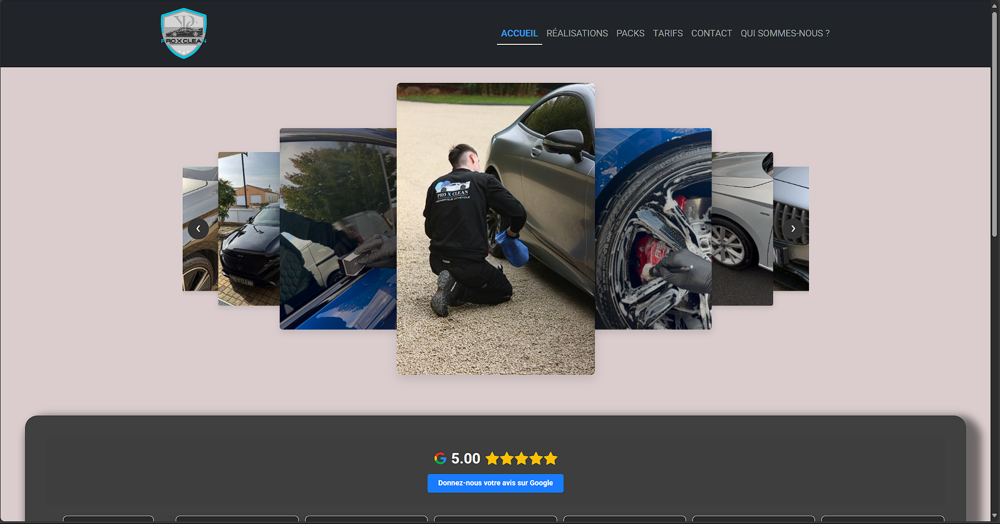

# 👋 Hi, I'm Gwenhaël Le Thiec

🎓 Computer Science student at CESI Reims — aspiring Web & AI Developer  
💡 Self-taught, curious, and driven by creativity and ethical tech  
🧠 Passionate about building innovative tools, solving real-world problems, and exploring machine intelligence

---

> 🎯 Currently seeking a 6-month internship (January–June 2026) as a Junior Developer  
> 🏢 Available for remote or on-site (Reims / Paris)  
> 📬 Contact me via [LinkedIn](https://www.linkedin.com/in/gwenhael-le-thiec) or email: gwenhael.lethiec@viacesi.fr

---

## 🚀 Projects I'm Proud Of

- 🤖 [OrionDigital](https://oriondigital.tech)  
  Personal showcase website — modern design, smooth animations, and fully responsive layout.  
  ➤ Built with Flask, featuring Text-to-Speech (TTS), voice command integration, and offline AI powered by Ollama APIs.

  

- 🔐 [GenPassV1](https://github.com/Gw3nhael51/GenpassV1)  
  First version of a Python-based password generator — simple CLI tool with environment setup.

- 🔒 [GenPassV2](https://github.com/Gw3nhael51/GenpassV2)  
  Improved version with robust password generation, auto-install scripts, and multilingual documentation.

  

- 🎨 [My Portfolio](https://myportfolio-by-swennsco.online)  
  Central hub featuring my projects, skills, résumé and career journey.

  

- 🧼 [Proxclean](https://proxclean.fr)  
  Professional website built for a cleaning service company — clean UI and SEO-optimized

  

---

## 🛠️ Technical Skills

**Languages & Frameworks**

**Databases & Tools**

**DevOps & AI**

**Software & Environments**

---

## 📫 Connect with me

- 🔗 [LinkedIn](https://www.linkedin.com/in/gwenhael-le-thiec)
- 🧠 [GitHub](https://github.com/Gw3nhael51)

---
## ✨ GitHub Animations & Live Stats

  

### 📌 Pinned Repositories

  

  

---

### 🏆 Github Trophies

  

---

> 🧠 _“Create, learn, share — that's my philosophy.”_
