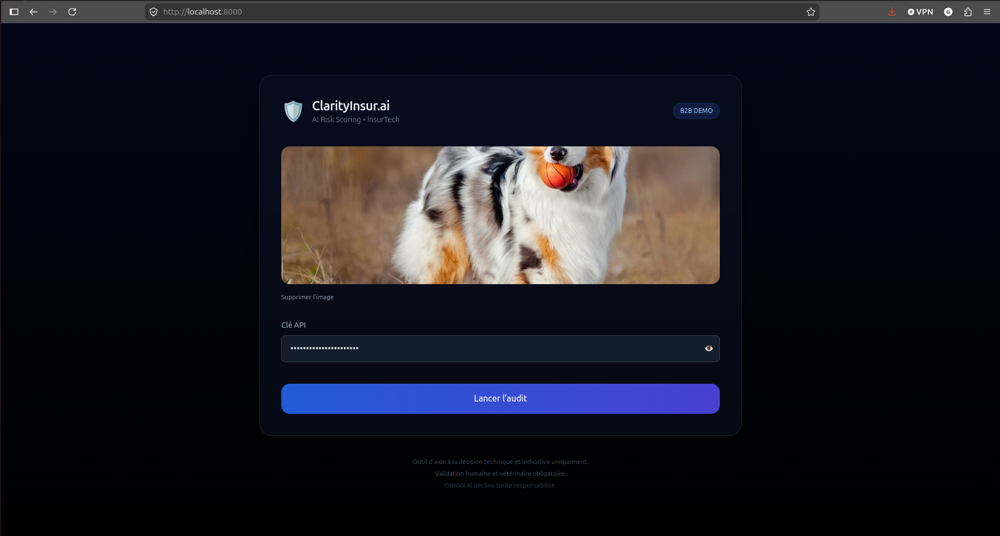
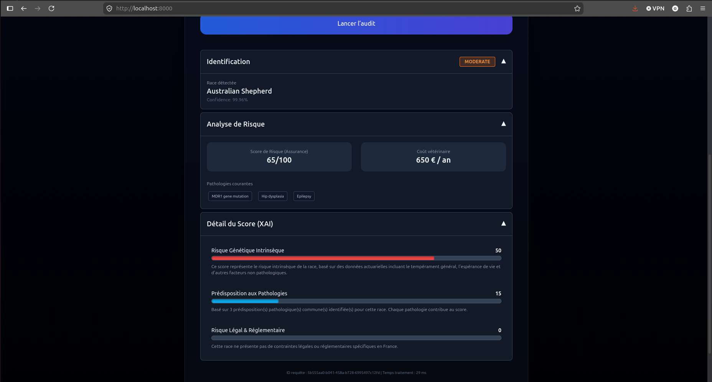

<p align="center">
  
</p>

<h1 align="center">Gwenhaël Le Thiec</h1>
<h2 align="center">Développeur Python • Backend • IA appliquée</h2>
<p align="center">APIs • Data Pipelines • Déploiement de modèles IA</p>

<p align="center" style="margin-top:20px;">
  <a href="https://wakatime.com/@Gw3gwe">
    
  </a>
</p>

<p align="center">
  <a href="https://www.linkedin.com/in/gwenhael-le-thiec/">
    
  </a>
  <a href="https://myportfolio-by-swennsco.online/">
    
  </a>
  <a href="https://github.com/Gw3nhael51">
    
  </a>
  <a href="https://oriondigital.tech/">
    
  </a>
</p>

---

<h1 align="center">Profil</h1>

Étudiant en **Bac+2 Informatique — CESI Reims**, en préparation d’un **Bac+3 CDA**.  
Spécialisation : **backend Python**, **API**, **pipelines data** et **IA appliquée** — intégration, optimisation et déploiement de modèles entraînés dans des applications concrètes.

- **🎓 Formation :** Bac+2 Informatique (CESI Reims) — poursuite en Bac+3 CDA  
- **💼 Actuellement :** Stagiaire Développement Web — **TDM‑GROUP** (Janvier → Juin 2026)  
- **🎯 Objectif :** Alternance **Python / Backend / Data / IA appliquée** (Août/Septembre 2026)

**Approche technique :**  
Je conçois et livre des solutions end‑to‑end :  
**FastAPI → Pipelines Data → Modèles IA (TensorFlow → ONNX) → Docker → Déploiement.**

> *IA appliquée = intégrer et déployer des modèles entraînés dans des systèmes réels, pas consommer des API externes.*

<h1 align="center">Stack technique</h1>

### Python, Data & IA appliquée:
<p align="left">
  <strong>Usage :</strong> prototypage, préparation de données et entraînement → export modèles pour inference locale. 🧠
</p>
<p align="center">
  
  
  
  
  
</p>

### Backend & Déploiement:
<p align="left">
  <strong>Usage :</strong> APIs, conteneurisation, bases relationnelles et déploiement. 🐳🗄️
</p>
<p align="center">
  
  
  
  
</p>

### Outils & Front-end
<p align="center">
  
  
  
  
</p>
<p align="left">
  <strong>Usage :</strong> interfaces, intégration front→back, gestion de versions et outils locaux pour LLMs. 🔧💻
</p>

---

# Projets principaux

## ClarityInsur.ai — IA appliquée (Assurance)  
`🔒 Private`

- **🖼️ Classification d’images :** entraînement et fine‑tuning (TensorFlow)  
- **🔁 Conversion & optimisation :** export vers ONNX, optimisation pour inference locale  
- **🧩 API & explication :** API FastAPI avec module XAI pour interprétabilité  
- **🚀 Déploiement :** conteneurisation Docker, pipeline CI/CD léger

<p align="center">
  
  
</p>

---

## ORION — Assistant Vocal Local (Ollama)  
`🔒 Private`

```
Pipeline :
Voix → STT → Llama3.1 (Ollama) → TTS → Google Home
```

<p align="center">
  
</p>

---

## Pipelines Data & Dashboards

<p align="left">
  <strong>🔁 Pipelines de données :</strong> extraction, nettoyage, transformation et préparation de datasets (Pandas)  
  <br>
  <strong>🧠 Modélisation :</strong> prototypes supervisés pour régression et classification (Scikit‑Learn)  
  <br>
  <strong>⚙️ IA appliquée :</strong> intégration et optimisation de modèles TensorFlow → ONNX pour l’inférence locale  
  <br>
  <strong>📊 Visualisation :</strong> dashboards interactifs Streamlit pour la restitution et l’analyse en temps réel  
</p>


## Projet citoyen — Application d’Émargement & Data Analyse  
<em>`🔒 Private`</em>

<p align="left">
  <strong>🔄 Pipeline complet :</strong> ingestion → nettoyage → analyse → visualisation  
  <br>
  <strong>📈 Data Analyse :</strong> statistiques de fréquentation, tendances, segmentation  
  <br>
  <strong>🧪 Modélisation :</strong> prototypes pour la prédiction de présence (Scikit‑Learn)  
  <br>
  <strong>🖥️ Dashboard :</strong> interface Streamlit pour la restitution en temps réel  
</p>

---

## Projets académiques (sélection)

<p align="left">
  <strong>💻 Développement logiciel :</strong> applications CRUD, architecture MVC (Java, PHP)  
  <br>
  <strong>🐍 Python :</strong> mini‑projets, scripts, jeux, automatisations  
  <br>
  <strong>🗄️ Bases de données :</strong> conception, SQL, schémas relationnels  
</p>

---

## Objectifs

<p align="left">
  <strong>🚀 Backend Python :</strong> FastAPI, architecture, bonnes pratiques  
  <br>
  <strong>🔧 IA appliquée :</strong> optimisation, conversion et déploiement de modèles IA (TensorFlow → ONNX)  
  <br>
  <strong>🔁 Pipelines & automatisation :</strong> outils internes, services, scripts  
  <br>
  <strong>⚡ Inference locale :</strong> ONNX Runtime, optimisation CPU/GPU  
</p>

---

# Activité

<p align="center">
  <a href="https://wakatime.com/@Gw3gwe">
    
  </a>
  <a href="https://wakatime.com/@Gw3gwe">
    
  </a>
</p>