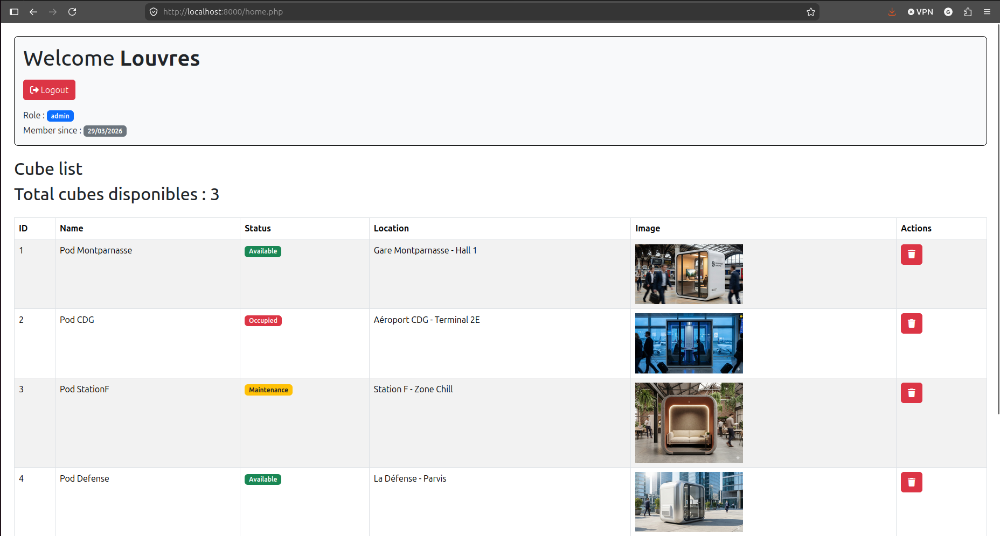
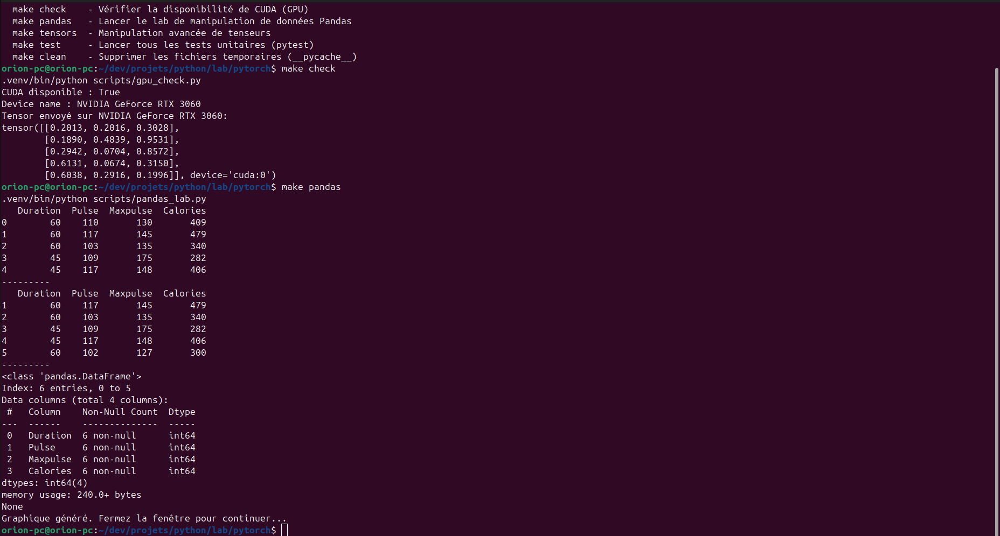

<p align="center">
  
</p>

<h1 align="center">Gwenhaël Le Thiec</h1>
<h2 align="center">AI Engineer & MLOps — De l'entraînement GPU au déploiement industriel</h2>
<p align="center">Vision • GPU Training • Industrial Deployment</p>


<p align="center" style="margin-top:20px;">
  <a href="https://wakatime.com/@Gw3gwe">
    
  </a>
</p>

<p align="center">
  <a href="https://www.linkedin.com/in/gwenhael-le-thiec/">
    
  </a>
  <a href="https://github.com/Gw3nhael51">
    
  </a>
  <a href="https://oriondigital.tech/">
    
  </a>
</p>

---

# 🎯 PROFIL

Étudiant en alternance au **CESI Reims (CDA Bac+3)**, spécialisé en **Computer Vision**, **MLOps** et **déploiement de modèles IA en production**.

- **Actuellement :** Stagiaire Développement Web chez **TDM-GROUP** (Janvier → Juin 2026)  
- **Objectif :** Alternance **AI Engineer / MLOps** (Août/Septembre 2026)

**Approche :**  
Je conçois des pipelines IA complets :  
**Entraînement GPU → Optimisation ONNX → API FastAPI → Conteneurisation Docker → Déploiement industriel.**

> *"De l'entraînement GPU au conteneur Docker ML end-to-end."*

---

# 🛠️ STACK TECHNIQUE

### 🧠 Vision par Ordinateur & ML
<p align="left">
  
  
  
  
  
  
</p>

### ⚙️ MLOps & Production
<p align="left">
  
  
  
  
  
</p>

### 🏗️ Backend & Infrastructure
<p align="left">
  
  
  
  
  
  
  
</p>

---

# 🚀 RÉALISATIONS TECHNIQUES

> *Certains dépôts sont privés pour raisons de confidentialité.*

---

## 🧠 ClarityInsur.ai — Vision AI Pipeline B2B  
**Classification & scoring de risques (Assurance)** `🔒 Private`

```
Précision : 96.28% | Races : 124 | Inférence : 8.74ms
```

**Tech :**  
- Fine-tuning **MobileNetV2**  
- Optimisation **ONNX Runtime**  
- API **FastAPI** + module **XAI**  
- Déploiement **Docker multi-stage**

<p align="center">
  
  
</p>

---

## 🤖 Jarvis — Assistant Vocal Local (Ollama)  
**Assistant vocal IA multimodal local** `🔒 Private`

Pipeline :  
```
Voix → STT → Llama3.1 (Ollama) → TTS → Google Home
```

**Tech :**  
- Docker Compose (app + Ollama + audio server)  
- Discord bot modulaire  
- Piper TTS FR  
- Orchestration Makefile

<p align="center">
  
</p>

---

## 🏗️ G2P4 — Système Industriel Containerisé  
**Projet académique (PHP 8.2 + MySQL + Docker)** `🔒 Private`

- Architecture **MVC**  
- Environnements **Dev/Test/Prod**  
- Makefile complet  
- GitFlow

<p align="center">
  
</p>

---

## 🔬 PyTorch Lab — FashionMNIST  
**Laboratoire PyTorch modulaire** `⏳ En cours`

- MLP custom  
- Tests Pytest  
- Pipeline GPU  
- CLI + Makefile  
- Structure ML pro

<p align="center">
  
</p>

---

# 📚 AUTRES PROJETS

### Computer Vision & ML
- **petsClassifier**
- **dog-risk-scoring-api**

### Data Analysis
- **streamlit** — Dashboards S&P 500  
- **Harvard-CS50AI-Projects** — BFS/DFS, logique, probas (code privé)

### Académique
- **AgroConnect** — JavaFX, MVC, ORM, rôles & CRUD

---

# 🔭 VISION & OBJECTIFS

- Segmentation & détection (YOLO, Mask R-CNN)  
- IA vocale locale (edge computing)  
- Domotique intelligente  
- Quantum ML (exploration)

---

# 📊 ACTIVITÉ

<p align="center">
  <a href="https://wakatime.com/@Gw3gwe">
    
  </a>
  <a href="https://wakatime.com/@Gw3gwe">
    
  </a>
</p>